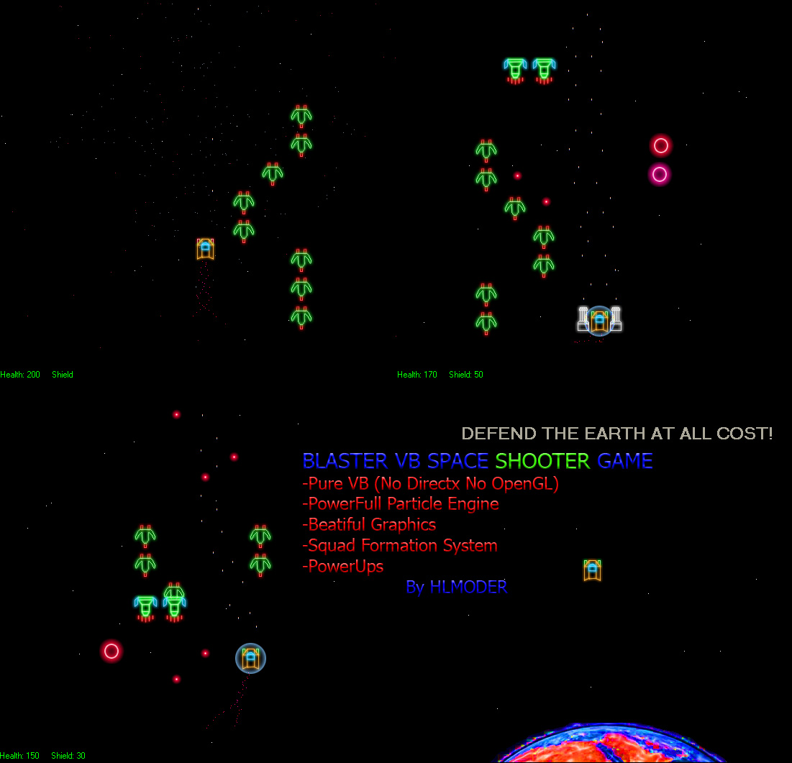



## BLASTER: 2D Space Shooter

### Description

BLASTER is a pure VB 2D space shooter.

What it offers:

-Fast Optimized Code

-PowerFull Particle System

-Cool Graphics

-Squad System

-PowerUps

-FUN!
 
### More Info
 

             |
---                |---
**Submitted On**   |2010-02-11 01:13:26
**By**             |[HLMODER](https://github.com/Planet-Source-Code/PSCIndex/blob/master/ByAuthor/hlmoder.md)
**Level**          |Intermediate
**User Rating**    |4.6 (37 globes from 8 users)
**Compatibility**  |VB 6\.0
**Category**       |[Games](https://github.com/Planet-Source-Code/PSCIndex/blob/master/ByCategory/games__1-38.md)
**World**          |[Visual Basic](https://github.com/Planet-Source-Code/PSCIndex/blob/master/ByWorld/visual-basic.md)
**Archive File**   |[BLASTER\_\_22174842122010\.zip](https://github.com/Planet-Source-Code/hlmoder-blaster-2d-space-shooter__1-72921/archive/master.zip)

